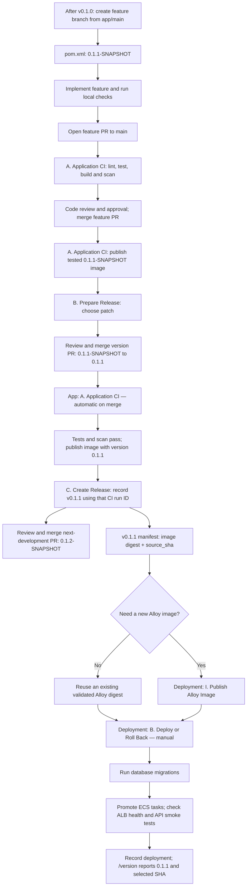

# Banking API on AWS

A Java banking demo with three authenticated operations: check a balance, deposit money and withdraw money. It uses Spring Boot, PostgreSQL, Terraform and GitHub Actions. All example accounts are synthetic.

## Start here

| What you need | Read this |
|---|---|
| Run the application on your computer | **[Local quickstart](QUICKSTART.md)** — prerequisites, commands for all three API operations, tests and cleanup |
| Try requests in Postman | [Importable collection and environment](app/postman/README.md) — Basic login, health, balances, deposits, withdrawals and retry checks |
| Create AWS infrastructure and deploy | **[AWS setup guide](SETUP.md)** — preparation, Terraform, secrets, CI/CD, first deployment and teardown, in order |
| Deploy a new application version | **[New-version deployment flow](#deploy-a-new-application-version)** — release preparation, image selection, deployment and verification |
| Understand the design | **[Architecture](docs/architecture.md)** — networking, security, CI/CD, monitoring and design choices |
| View application metrics, logs and service graph | [Observability guide and Grafana login](docs/observability/README.md) |
| Check costs and account restrictions | [AWS compatibility and budget](docs/budget.md) |
| Review public repository status and maintenance | [Public repository notes](docs/public-sharing.md) |

## Ready-to-import Postman collection

A Postman collection and environment template are included, ready to import:

- [Banking API collection](app/postman/Banking-API.postman_collection.json) — login, health, balance, deposit, withdrawal and retry checks.
- [Environment template](app/postman/Local.postman_environment.json) — connection settings with empty credentials.

In Postman, choose **Import** and select both JSON files. Select the imported environment, set `base_url` to `https://bnk-api.tzwei.me`, and fill `token_username` and `token_password` with your API credentials locally. Send **Authentication → Get token**; it saves the Bearer token automatically for the banking requests. See the [Postman guide](app/postman/README.md) for the request sequence and local environment setup.

## Review environment URLs

These URLs identify the configured review environment; they are not a live availability report. For another installation, replace the hostnames with your own.

| Service | URL | Usage |
|---|---|---|
| API base URL | [https://bnk-api.tzwei.me](https://bnk-api.tzwei.me) | Set this as Postman's `base_url`; the root path is not an application UI. |
| Liveness | [https://bnk-api.tzwei.me/livez](https://bnk-api.tzwei.me/livez) | `GET`, no authentication. |
| Readiness | [https://bnk-api.tzwei.me/readyz](https://bnk-api.tzwei.me/readyz) | `GET`, no authentication; checks database connectivity. |
| Build version | [https://bnk-api.tzwei.me/version](https://bnk-api.tzwei.me/version) | `GET`, no authentication; reports the application version and source commit. |
| API login | [https://bnk-api.tzwei.me/auth/token](https://bnk-api.tzwei.me/auth/token) | `POST` with HTTP Basic credentials; returns a Bearer token. Use Postman or an API client. |
| Grafana login | [https://grafana.tzwei.me/login](https://grafana.tzwei.me/login) | Sign in with the Grafana viewer credentials below. |
| API overview | [Grafana overview](https://grafana.tzwei.me/d/banking-api-overview?orgId=2) | Traffic, HTTP errors, latency, JVM health and connection pools. |
| Application logs | [Grafana log search](https://grafana.tzwei.me/d/banking-api-logs?orgId=2) | Filter application logs by environment, operation, severity and message. |
| Service dependencies | [Grafana service graph](https://grafana.tzwei.me/d/banking-api-service-graph?orgId=2) | Trace-derived dependencies, request rates, errors and latency. |

The authenticated banking routes are `GET /accounts/{id}/balance`, `POST /accounts/{id}/deposits` and `POST /accounts/{id}/withdrawals`, relative to the API base URL. See the [Postman guide](app/postman/README.md) for request bodies, account IDs and idempotency keys.

### Credential placeholders

| Credential | Placeholder | Where to use it |
|---|---|---|
| API username | `<API_USERNAME>` | Postman `token_username` / HTTP Basic username for `POST /auth/token`. |
| API password | `<API_PASSWORD>` | Postman `token_password` / HTTP Basic password for `POST /auth/token`. |
| API access token | `<API_ACCESS_TOKEN>` | `Authorization: Bearer <API_ACCESS_TOKEN>` on banking requests; Postman's **Get token** saves it automatically. |
| Grafana username | `<GRAFANA_USERNAME>` | Grafana login; use the viewer account for **Banking API Review** (`orgId=2`). |
| Grafana password | `<GRAFANA_PASSWORD>` | Grafana login. |

Obtain current credentials privately from the environment owner and replace the placeholders only in your local client. API and Grafana logins are separate. See the [observability guide](docs/observability/README.md) for dashboard usage and viewer access details.

## Architecture

Clients → HTTPS load balancer → two private Java/Alloy Fargate tasks → private PostgreSQL RDS. A private EC2 runner publishes images and runs deployment jobs. Terraform manages the ECR repositories; monitoring services are configured separately.

[Interactive diagram](docs/architecture/banking-platform.html) · [Detailed architecture and security](docs/architecture.md)

## Source repositories

This repository pins two Git submodules. Each has its own GitHub Actions workflows.

| Deliverable | Source | Repository URL |
|---|---|---|
| Application code, Dockerfile and CI | [app/](app) | [Application repository](https://github.com/tzwei94/app) |
| Terraform and deployment pipeline | [deployment/](deployment) | [Infrastructure repository](https://github.com/tzwei94/deployment) |

See [application reference](app/README.md) and [deployment reference](deployment/README.md) for implementation details.

## Deploy a new application version

For an existing environment, follow the flow below. Complete the [AWS setup guide](SETUP.md) first for a new environment, including infrastructure, database bootstrap, secrets and runners. Workflow letters organize the Actions list; they do not automatically chain the application and deployment repositories together.

1. **Start the next release on a feature branch.** In the application repository, update your local `main` and create a branch such as `feature/transfer-validation`. Develop against the next Maven snapshot version in `pom.xml`, for example `0.1.1-SNAPSHOT` after release `0.1.0`. Normally **C. Create Release** has already opened a next-development version PR: review and merge that PR, then bring the updated `main` into your feature branch. Keep this snapshot version throughout feature development; each feature branch does not need its own version increment. The final patch, minor or major version is chosen during release preparation.
2. **Implement, review and merge the feature.** Make the code changes, run local checks, push the feature branch and open a PR targeting `main`. **A. Application CI** runs lint, tests, image build and scan on the PR. Address review feedback and failed checks, obtain approval, then merge. The main-push CI repeats the checks and publishes a snapshot image. Repeat this development cycle for any other features included in the release; merging a feature does not deploy it.
3. **Prepare the final release version.** Once the planned features are merged and main CI passes, run [B. Prepare Release](app/.github/workflows/prepare-release.yml) on `main`, choosing `patch`, `minor` or `major`. Review its version-only PR and merge after the checks pass.
4. **Wait for the merged version's CI.** The merge starts [A. Application CI](app/.github/workflows/app-ci.yml), which tests, builds, scans and publishes the final-version image. Use the successful **main-push run for this merge**, not the PR check run or an unrelated later run. Copy its run ID.
5. **Record the release.** Run [C. Create Release](app/.github/workflows/release.yml) on `main` with that `ci-run-id`. It creates the version tag and GitHub Release with `image-manifest.json`, referencing the existing image. Download that manifest or use the release workflow's deployment summary. Review and merge the next-development snapshot PR it opens; that PR is separate from the image selected for deployment.
6. **Select the Alloy image.** Reuse the existing validated `alloy_image` digest when no collector update is needed. Run [I. Publish Alloy Image](deployment/.github/workflows/publish-alloy.yml) when you need a new collector build or have no validated digest yet, then copy `alloy_image` from its successful summary or artifact. Publishing Alloy alone does not update the running service.
7. **Deploy in the deployment repository.** Ensure the selected deployment `main` revision has passed [A. Deployment CI](deployment/.github/workflows/terraform-ci.yml). Open [B. Deploy or Roll Back](deployment/.github/workflows/deploy-dev.yml), select `main`, and supply the inputs below. Deployment CI validates the deployment code; it does not deploy the application. Infrastructure changes require their own reviewed operator plan/apply before this application deployment.

| Deployment input | Value for a normal new-version deployment |
|---|---|
| `image` | Exact `image` from the selected app release's manifest, in `repository@sha256:...` form. |
| `source_sha` | Full application commit SHA from that **same** manifest. Do not use the deployment or Alloy commit SHA. |
| `alloy_image` | Existing validated Alloy digest, or the digest from a successful new Alloy publication, in `repository@sha256:...` form. |
| `action` | `deploy` |
| `first_release` | `false` for an existing environment; `true` only for the initial deployment after database bootstrap. |

8. **Verify the result.** Wait for the deployment workflow to complete its migration, ECS promotion, health checks, authenticated smoke tests and deployment-manifest recording. Check `/readyz` and confirm `/version` reports the selected version and application SHA. Inspect the [dashboards and logs](docs/observability/README.md) and follow the [deployment checks](docs/verification.md#deployment-checks). A successful image publication or GitHub Release alone does not mean the version is deployed.

**Rollback:** Run **B. Deploy or Roll Back** with `action=rollback` and `first_release=false`. The workflow still requires valid image and SHA inputs, but selects the retained previous task definition from the deployment manifest. It checks health and updates the manifest; it does not reverse database migrations. See the [deployment reference](deployment/README.md) for rollback details and the [application release guide](app/docs/ci-cd.md) for release validation and reruns.

## What is implemented

| Area | Implementation |
|---|---|
| Infrastructure | VPC, public/private/isolated subnets, ALB, Fargate, RDS and runner; reusable Terraform modules |
| Application | JWT ownership checks, precise money arithmetic, database transactions and idempotent deposits/withdrawals |
| Delivery | Tests → build → scan → publish immutable image; separate manual migration/deployment and rollback |
| Security | Security groups, private workloads, encrypted storage, TLS, scoped IAM, GitHub OIDC and Secrets Manager |
| Monitoring | CloudWatch alarms/logs and SNS; Alloy image forwards application logs, metrics and traces; per-app settings are supplied at deployment |
| Documentation | Architecture with diagram, source locations, local quickstart and sequential AWS deployment guide |

## Documentation scope

The guides describe the source checked on 27 September 2026. Deployment status and dated scan/access records are separate from source verification; use the [verification guide](docs/verification.md) to check your environment.

## Current limitations

- The API operates on synthetic seeded accounts; account creation, customer onboarding and an external identity provider are outside its scope.
- The dev baseline has two API tasks, but Single-AZ RDS, one NAT gateway, one runner and external monitoring remain single points of failure. Autoscaling is not configured.
- Application rollback restores a previous task definition; it does not roll back database migrations.
- Local smoke checks use a telemetry test receiver. Live backend ingestion, recovery and deployment health need the [deployment checks](docs/verification.md#deployment-checks).

All three repositories are already public. See [public repository status and maintenance](docs/public-sharing.md) for the verified history scope and credential handling. The [Alloy scan record](deployment/deploy/monitoring/security-review.md) records the successful 1.20.0 candidate scan; image publication performs a new scan.
