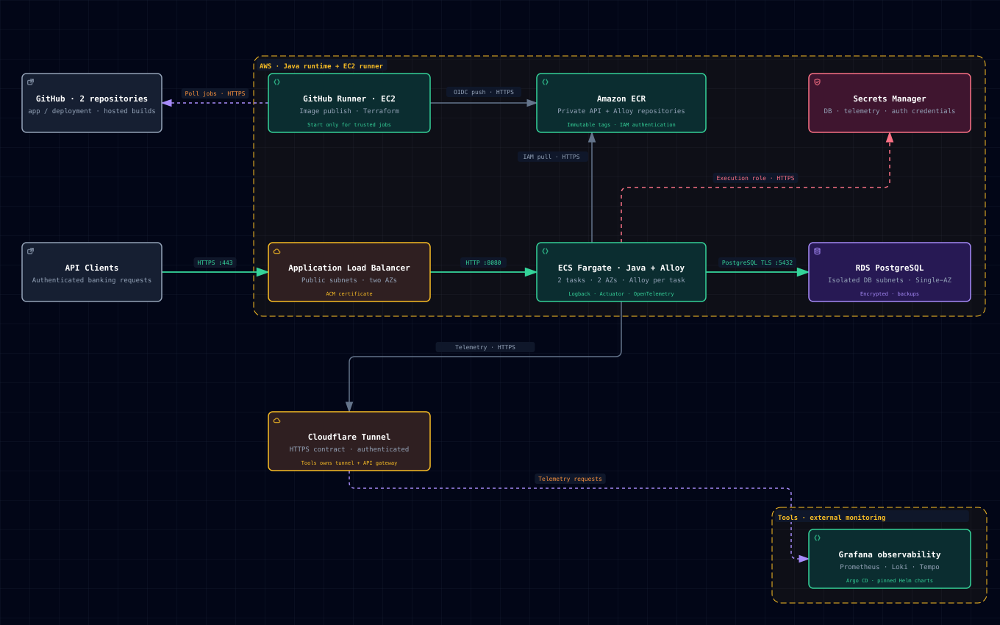

# Banking API on AWS

A Java banking demo with three authenticated operations: check a balance, deposit money and withdraw money. It uses Spring Boot, PostgreSQL, Terraform and GitHub Actions. All example accounts are synthetic.

## Start here

| What you need | Read this |
|---|---|
| Run the application on your computer | **[Local quickstart](QUICKSTART.md)** — prerequisites, commands for all three API operations, tests and cleanup |
| Try requests in Postman | [Importable collection and environment](app/postman/README.md) — Basic login, health, balances, deposits, withdrawals and retry checks |
| Create AWS infrastructure and deploy | **[AWS setup guide](SETUP.md)** — preparation, Terraform, secrets, CI/CD, first deployment and teardown, in order |
| Understand the design | **[Architecture](docs/architecture.md)** — networking, security, CI/CD, monitoring and design choices |
| View application metrics, logs and service graph | [Observability guide and Grafana login](docs/observability/README.md) |
| Check costs and account restrictions | [AWS compatibility and budget](docs/budget.md) |
| Review public repository status and maintenance | [Public repository notes](docs/public-sharing.md) |

## Architecture

Clients → HTTPS load balancer → two private Java/Alloy Fargate tasks → private PostgreSQL RDS. A private EC2 runner publishes images and runs deployment jobs. Terraform manages the ECR repositories; monitoring services are configured separately.

[Interactive diagram](docs/architecture/banking-platform.html) · [Detailed architecture and security](docs/architecture.md)

## Source repositories

This repository pins two Git submodules. Each has its own GitHub Actions workflows.

| Deliverable | Source | Repository URL |
|---|---|---|
| Application code, Dockerfile and CI | [app/](app) | [Application repository](https://github.com/tzwei94/app) |
| Terraform and deployment pipeline | [deployment/](deployment) | [Infrastructure repository](https://github.com/tzwei94/deployment) |

See [application reference](app/README.md) and [deployment reference](deployment/README.md) for implementation details.

## What is implemented

| Area | Implementation |
|---|---|
| Infrastructure | VPC, public/private/isolated subnets, ALB, Fargate, RDS and runner; reusable Terraform modules |
| Application | JWT ownership checks, precise money arithmetic, database transactions and idempotent deposits/withdrawals |
| Delivery | Tests → build → scan → publish immutable image; separate manual migration/deployment and rollback |
| Security | Security groups, private workloads, encrypted storage, TLS, scoped IAM, GitHub OIDC and Secrets Manager |
| Monitoring | CloudWatch alarms/logs and SNS; Alloy image forwards application logs, metrics and traces; per-app settings are supplied at deployment |
| Documentation | Architecture with diagram, source locations, local quickstart and sequential AWS deployment guide |

## Documentation scope

The guides describe the source checked on 27 September 2026. Deployment status and dated scan/access records are separate from source verification; use the [verification guide](docs/verification.md) to check your environment.

## Current limitations

- The API operates on synthetic seeded accounts; account creation, customer onboarding and an external identity provider are outside its scope.
- The dev baseline has two API tasks, but Single-AZ RDS, one NAT gateway, one runner and external monitoring remain single points of failure. Autoscaling is not configured.
- Application rollback restores a previous task definition; it does not roll back database migrations.
- Local smoke checks use a telemetry test receiver. Live backend ingestion, recovery and deployment health need the [deployment checks](docs/verification.md#deployment-checks).

All three repositories are already public. See [public repository status and maintenance](docs/public-sharing.md) for the verified history scope and credential handling. The [Alloy scan record](deployment/deploy/monitoring/security-review.md) records the successful 1.20.0 candidate scan; image publication performs a new scan.
