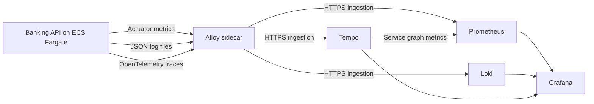

# Observability

Use Grafana to inspect the Banking API's metrics, application logs, and trace-derived service dependencies.

## Grafana login

| Setting | Value |
|---|---|
| URL | [Grafana](https://grafana.tzwei.me/login) |
| Username | `banking-viewer` |
| Password | `rrQe0Aruxg4UFxxWe6Qf_qWC7_9Cmor4s2PsxJWJ` |
| Organization | **Banking API Review** (`orgId=2`) |
| Access | View-only access to the three Banking API dashboards below |

## Dashboards

| Dashboard | What to use it for |
|---|---|
| [Overview](https://grafana.tzwei.me/d/banking-api-overview?orgId=2) | Task scrape health, API traffic, HTTP status codes, mean latency, banking operations, JVM health, and database connection pools |
| [Log Search](https://grafana.tzwei.me/d/banking-api-logs?orgId=2) | Search readable application messages by environment, operation, severity, task, and message text |
| [Service Graph](https://grafana.tzwei.me/d/banking-api-service-graph?orgId=2) | Inspect trace-derived dependencies, request rates, error ratios, and dependency latency |

Start with **Overview** and select the environment and instance. With both deployed tasks running, healthy scrapes should total two. Missing telemetry is different from zero traffic: check scrape health before interpreting empty panels. API traffic excludes readiness and Actuator requests. Mean API latency is a request-weighted average, not a percentile.

For an individual operation, open **Log Search**, choose `deposit` or `withdrawal`, and enter a phrase in **Message contains**. The search is case-sensitive; leave it empty to show all matching messages. Avoid backticks in search text. The dashboard shows up to 1,000 messages, newest first. Expand a row for fields such as severity, task, and `trace_id`. Operation filtering matches message text; rejected requests and idempotent retries may not have an operation message.

Use **Service Graph** to inspect the Banking API's database dependency. The database node is inferred from JDBC spans. This view includes health checks and sampled traces, so its request rates can differ from the API overview. The p95 panel is an approximate histogram percentile. Idle periods can leave latency or error ratios undefined. Graph metrics begin when generation is enabled; historical traces are not backfilled.

## Telemetry flow

Each Fargate task has an Alloy sidecar. Alloy scrapes application metrics every 60 seconds, reads structured application logs, and receives OTLP traces. The dashboards query Prometheus, Loki, and Tempo. Application log records include trace IDs for correlation; these identifiers are not Loki stream labels.

The overview uses rate windows of at least four minutes to accommodate the scrape interval. Allow time for new requests to be collected, and widen the dashboard time range when investigating earlier activity. Trace sampling means not every request has a stored trace.

## Viewer permissions

The account can change time ranges and filters and inspect results. It cannot save or edit dashboards, create folders, administer Grafana, or access the infrastructure dashboards in Main Org.

Dashboard visibility is restricted, but the shared data sources are not tenant-filtered: Grafana OSS viewers can query data beyond the dashboard filters. See the [access configuration and verification record](viewer-access.md) for the exact scope.

## Dashboard definitions and maintenance

The repository contains exports of the prepared dashboards:

- [Overview JSON](banking-api-dashboard.json)
- [Log Search JSON](banking-api-logs.json)
- [Service Graph JSON](banking-api-service-graph.json)

The viewer organization holds separate copies from Main Org. Update both copies when changing a dashboard, preserving their UIDs and the viewer's explicit View permissions. Account and organization settings are stored in Grafana's database. After rotating the viewer password, update this guide and the owner's private credential record together.

For collection settings, buffering limits, deployment variables, and local validation commands, see the [Alloy telemetry contract](../../deployment/deploy/monitoring/README.md).
